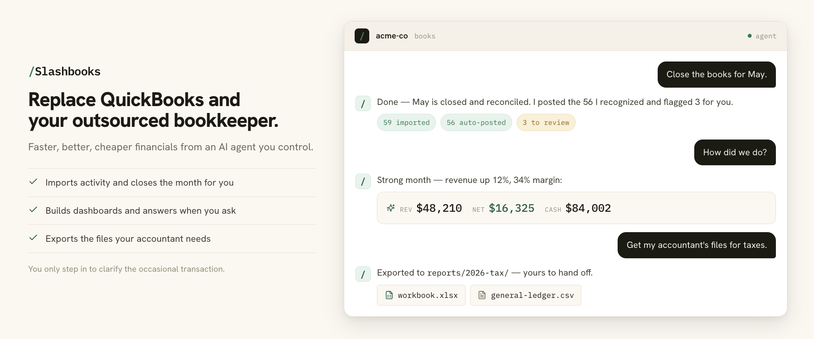

# Slashbooks

Bookkeeping for people who keep putting it off. Your AI agent keeps the
books current and tax-ready, so you always know where you stand.

**Replace QuickBooks and your outsourced bookkeeper.** Slashbooks gives you
faster, better, cheaper financials from an AI agent you control. It runs in
Claude Cowork, Claude Code, Codex, and other agents. Use the `/books` skill or
just ask in plain English.

It does the tedious work: set up the books, pull in bank and card activity,
categorize the repeat transactions, close the month, answer your questions, and
export the files your accountant needs. You only step in to help clarify the
occasional transaction.

No bloated accounting app. No spreadsheet wrangling. Nothing new to learn.

> **Why I built this:** I was tired of paying for QuickBooks and an outsourced
> bookkeeper for books that were always behind, so I built a bookkeeper my AI
> agent runs and that I control.

Your books also stay yours: they live in local files you own, not a vendor's
cloud. Slashbooks works from QuickBooks exports and live bank/card feeds (via
BankSync) and exports the Excel/CSV files your accountant needs; it does not sync
back to QuickBooks or Google Sheets.

**[Install for Claude Cowork, Claude Code, or Codex →](#install)**

## What You Can Do

- Start books for a company in an empty directory.
- Keep the ledger as local plain-text files you own.
- Connect Stripe, Mercury, and bank feeds, or have your agent build a connector for anything else.
- Schedule the monthly close to run on its own, with current books waiting.
- Review unfamiliar transactions before they become trusted rules.
- Ask for an analysis of anything, anytime, with every figure at hand.
- Get any report, chart, or export on demand, without clicking around an app.
- Backtest against QuickBooks exports (prove the numbers match) before trusting a migration.
- Export the workbook and CSV files your accountant needs at tax time.

## Status

Slashbooks is beta software. Use it for cash-basis owner-operated businesses only,
review its output, and keep an accountant or tax professional in the loop.

Slashbooks is not tax, legal, accounting, payroll, inventory, or investment advice.
It doesn't replace professional review, and it isn't designed for businesses
that need payroll, inventory, multi-user accounting controls, or full accrual
accounting (yet). We're open to expanding what it covers; if you'd like to help,
see [CONTRIBUTING.md](CONTRIBUTING.md).

## Start Here

To use Slashbooks for a company, read:

- [How to do your books with Slashbooks](docs/doing-your-books.md)
- [Accounting philosophy](docs/philosophy.md)
- [For accountants](docs/for-accountants.md)
- [Connectors](docs/connectors.md)
- [BankSync setup](docs/banksync.md)
- [CSV, QuickBooks, and file imports](docs/imports.md)

The short version: after installing the plugin, create or choose a folder for
this company's books. For example, use a folder named after the company inside
Documents, such as `Documents/books/acme-co`. Do not use the plugin source repo
as the company books folder.

Then open that folder in Claude Cowork, Claude Code, or Codex and say:

> I want to set up books for this company here.

The agent will ask onboarding questions and create the starter files for you.
Plugin upgrades should never overwrite company books.

## Install

Pick the app you prefer. Install the plugin once, then use it from a
separate company books folder such as `~/Documents/books/acme-co/`.

### Claude Cowork

Best for most people. Cowork gives you a guided workspace for setup, review, and
monthly bookkeeping without living in a terminal.

1. Open Claude and go to **Cowork**.
2. Open **Customize**.
3. Go to **Plugins**.
4. Under **Personal plugins**, click **+**.
5. Choose **Add marketplace**. If your UI first shows **Create plugin**, choose
   that, then **Add marketplace**.
6. Paste:

   ```text
   https://github.com/giltotherescue/slashbooks
   ```

7. Click **Sync**.
8. Install or enable `/books` from the synced marketplace.

### Claude Code

Use this if you prefer Claude in a terminal.

```sh
/plugin marketplace add https://github.com/giltotherescue/slashbooks
/plugin install books@slashbooks
```

### Codex

Use this if you prefer OpenAI Codex for local coding-agent work.

```sh
codex plugin marketplace add https://github.com/giltotherescue/slashbooks
```

Then restart Codex if needed, open the plugin directory, choose the Slashbooks
marketplace, and install the plugin.

### Development

```sh
git clone https://github.com/giltotherescue/slashbooks slashbooks
cd slashbooks
pip install -e .
python3 -m unittest discover -s tests
```

The public command is `books`.

## Workflows

Start with `/books` or natural language like “do my books here.” That router
checks whether the current directory already has an entity and sends the agent to
the right workflow.

```text
/books
├── /books-onboard      set up a company, sources, and opening balances
├── /books-backtest     compare against QuickBooks exports before trusting it
├── /books-checkup      review setup, mappings, and close readiness
├── /books-close        import activity, review unknowns, and finalize a period
├── /books-dashboard    create dashboards, snapshots, and formatted reports
├── /books-review       resume or work through queued transactions
├── /books-ask          answer questions from the ledger
└── /books-export       export the workbook and CSV files accountants need
```

The agent workflows call the `books` CLI and don't compute financial totals
themselves.

## Company Data

Each company directory contains its own books and generated state:

```text
acme-co/
├── entity.json
├── trust-policy.json
├── books.beancount
├── chart-of-accounts.beancount
├── audit-log.jsonl
├── staging/
├── review-queue/
├── learned-context/
├── ingestion/
└── reports/
```

Slashbooks stores company data locally in the company directory you choose. The
plugin does not host your books.

Context and preferences live there too:

- `business-profile.md` keeps human-readable business background and accountant
  context.
- `entity.json` stores structured settings such as legal structure, business
  type, dates, mappings, and jurisdiction context.
- `trust-policy.json` controls how conservative Slashbooks is before auto-posting
  repeat transactions.
- `learned-context/` records what Slashbooks learns from owner review decisions,
  such as usual categories for counterparties.
- `review-queue/` holds transactions waiting for owner judgment.
- `audit-log.jsonl` records important changes and review actions.

Credentials should live in `.env`, your OS credential store, or another local
ignored secrets file. The `books` command reads `./.env` from the current company
directory. Do not commit API keys, bank exports, QuickBooks exports, company
ledgers, generated reports, or entity directories.

## Contributing

See [CONTRIBUTING.md](CONTRIBUTING.md). Do not commit API keys, bank exports,
QuickBooks exports, company ledgers, generated reports, or entity directories.

## Support

For bugs, feature requests, and questions, open a GitHub issue.

## License

Apache-2.0. See [LICENSE](LICENSE).

Project names and logos are not licensed under Apache-2.0. See
[TRADEMARKS.md](TRADEMARKS.md).
