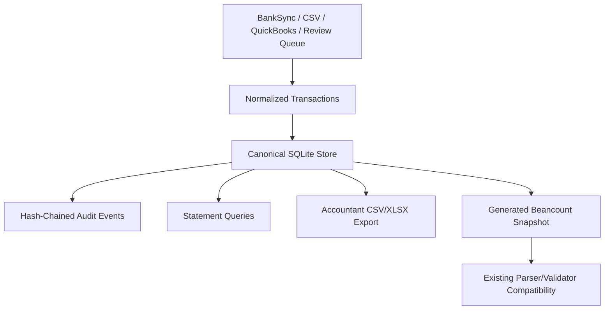
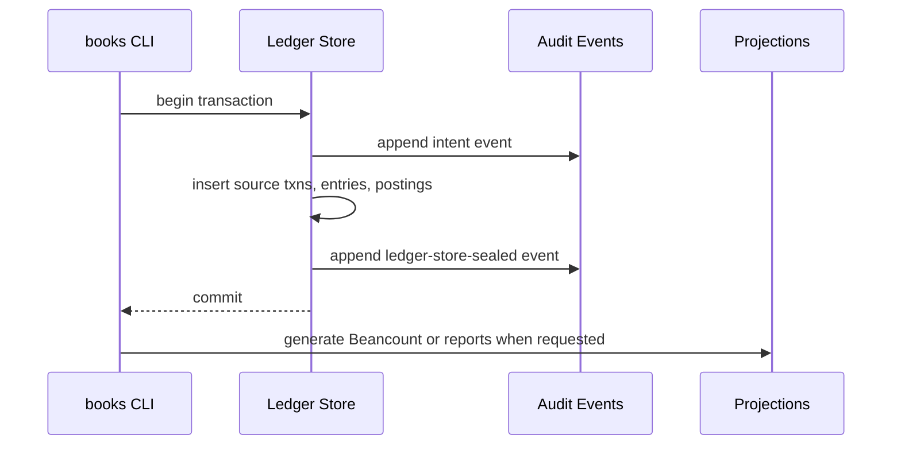

# refactor: Add scalable canonical ledger store

## Summary

Move Slashbooks toward a scalable canonical SQLite ledger store while preserving the current local-file product model, deterministic Beancount output, accountant exports, and audit guarantees. The refactor should land incrementally: introduce the store and equivalence tests first, then route imports, review confirmations, reporting, and exports through the new store without breaking existing entity directories.

---

## Problem Frame

Slashbooks needs a store-first ledger architecture before public use. Beancount
is still valuable as a deterministic export, but normal imports, review
confirmations, corrections, reports, and audit events should work from the
canonical local store.

This design keeps simple cash-basis books inspectable while avoiding full-file
rewrites and full-cache regeneration as transaction counts, review confirmations,
corrections, and exports grow.

---

## Requirements

**Canonical storage**

- R1. The system must support a normalized SQLite ledger store as the canonical mutation surface for entries, postings, source transactions, import sessions, review decisions, audit events, account openings, and balance assertions.
- R2. New entity directories must initialize the store directly rather than treating `books.beancount` as the ledger source of truth.
- R3. Generated Beancount output must remain deterministic and semantically equivalent to the store projection for supported entries.
- R4. CLI commands may change where no external user contract exists; prefer the clean store-first design over compatibility shims.

**Accounting correctness**

- R5. Every posted entry must remain double-entry balanced with Decimal-safe amount handling.
- R6. Source IDs must remain unique for posted source transactions, while reversals and corrections must preserve their current trace semantics.
- R7. Reports must continue to produce the same P&L, balance sheet, trial balance, general ledger, reconciliation, vendor, adjustment, and open-question outputs for equivalent input data.

**Audit and safety**

- R8. Ledger mutations must be atomic at the storage layer and leave a tamper-evident audit trail.
- R9. The audit model must verify the store event chain and detect store tampering or impossible partial-write states.
- R10. Exported Beancount snapshots are artifacts, not mutation surfaces, and should be generated only when requested.

**Scale and export control**

- R11. Importing a batch should perform work proportional to the batch plus indexed lookups, not proportional to the full historical ledger.
- R12. Accountant export must allow selecting sheets and period windows so large general-ledger exports can be limited without changing report definitions.
- R13. Large export paths must continue to write CSV even when XLSX is unavailable or too large.

---

## Key Technical Decisions

- KTD1. SQLite becomes the canonical write store, not only a cache: SQLite gives ACID transactions, indexes, foreign keys, and portable local ownership without adding a server dependency.
- KTD2. Beancount becomes a deterministic projection: snapshots remain shareable and accountant-readable, but they are generated artifacts, not the primary ledger.
- KTD3. Because no production entity directories exist yet, prefer direct store initialization and store-only write paths over compatibility layers.
- KTD4. Preserve the hash-chain audit model inside the new store with `prev_hash`, `record_hash`, event type, timestamps, and payload.
- KTD5. Keep the core dependency-free: use Python's standard `sqlite3`, `decimal`, and filesystem APIs. The optional `xlsx` extra remains the only optional export dependency.
- KTD6. Treat the store projection as the oracle: tests should compare parsed entries, postings, report totals, and generated exports rather than asserting only row counts.

---

## High-Level Technical Design

---

## Scope Boundaries

### In Scope

- Add a canonical SQLite store and migration path for existing Beancount-ledger entities.
- Route imports and queue confirmations through the store after equivalence coverage exists.
- Update reports and accountant export to query the canonical store directly.
- Add sheet and period selection to accountant export.
- Preserve deterministic Beancount generation as an export/snapshot.

### Deferred to Follow-Up Work

- Multi-user collaboration and server-hosted synchronization.
- Cloud backup, encryption-at-rest UX, or remote database support.
- Payroll, inventory, accrual accounting, and tax filing logic.
- Parquet export for very large ledgers.
- Native QBO journal-entry import/sync.

---

## System-Wide Impact

This refactor changes the core persistence boundary for the product. Import, review queue confirmation, corrections, reconciliation, reports, accountant exports, cache behavior, audit integrity, and documentation all depend on the current file-first model. The plan must keep existing files readable while introducing the store, because users own local company directories and plugin upgrades must not overwrite company data.

---

## Implementation Units

### U1. Define Canonical Store Schema

- **Goal:** Add a SQLite schema and store module for canonical ledger state.
- **Requirements:** R1, R5, R6, R8, R11.
- **Dependencies:** None.
- **Files:** `src/bookkeeping/ledger/store.py`, `tests/test_ledger_store.py`.
- **Approach:** Create tables for accounts/open directives, entries, postings, source transactions, import sessions, audit events, balance assertions, and schema metadata. Store amounts as text decimal strings, enforce foreign keys, add unique indexes for source IDs, and keep correction/reversal metadata queryable.
- **Patterns to follow:** `src/bookkeeping/reports/cache.py` for SQLite lifecycle, atomic replacement style, Decimal-as-text storage, and fallback-safe behavior.
- **Execution note:** Implement store behavior test-first before routing any production writer through it.
- **Test scenarios:**
  - Creating a new store initializes all tables, foreign keys, and schema metadata.
  - Inserting a balanced entry persists one entry and all postings with exact Decimal string values.
  - Inserting an unbalanced entry is rejected before commit.
  - Reusing a source ID for a normal posted transaction is rejected.
  - Reversal and correction metadata can reference an original source ID and remain queryable.
  - A failed multi-entry transaction rolls back all inserted rows.
- **Verification:** Tests prove table shape, constraints, rollback behavior, and Decimal preservation without touching `books.beancount`.

### U2. Build Beancount-to-Store Migration

- **Goal:** Provide a development/import utility for loading Beancount fixtures or QuickBooks-generated ledgers into the canonical store.
- **Requirements:** R3, R5, R6.
- **Dependencies:** U1.
- **Files:** `src/bookkeeping/ledger/migrate.py`, `src/bookkeeping/cli.py`, `tests/test_ledger_migrate.py`.
- **Approach:** Parse a ledger with `parse_ledger`, load opens, balances, entries, postings, tags, links, and metadata into the store, and record a migration event. Add a CLI surface that can run in dry-run mode and report counts plus validation errors.
- **Patterns to follow:** `src/bookkeeping/ledger/importer.py` for entity paths and integrity language, `src/bookkeeping/quickbooks.py` for deterministic generated ledger comparisons.
- **Execution note:** Add characterization fixtures from existing tests before implementing migration.
- **Test scenarios:**
  - Migrating `tests/fixtures/ledger/golden.beancount` preserves entry dates, narration, payee, source ID, import session, accounts, amounts, and currencies.
  - Migrating a ledger with corrections and reversals preserves `reverses` and `correction-of` trace metadata.
  - Dry-run reports counts and does not create or mutate a store file.
  - Invalid Beancount input returns validation errors and leaves any prior store intact.
  - Re-running migration is idempotent when the store already reflects the same ledger snapshot.
- **Verification:** Migration tests compare parsed Beancount structures to store query results field by field.

### U3. Generate Deterministic Beancount Snapshots from Store

- **Goal:** Preserve Beancount as a deterministic export generated from canonical store rows.
- **Requirements:** R3, R7, R9, R10.
- **Dependencies:** U1, U2.
- **Files:** `src/bookkeeping/ledger/projections.py`, `src/bookkeeping/ledger/writer.py`, `tests/test_ledger_projections.py`.
- **Approach:** Query store rows into existing `Open`, `Entry`, `Posting`, and `Balance` models, then reuse `render_ledger`. Write generated snapshots only through explicit snapshot/export commands.
- **Patterns to follow:** `src/bookkeeping/ledger/writer.py` for deterministic output and injection-safe escaping, `tests/fixtures/ledger/golden.beancount` for projection fixtures.
- **Test scenarios:**
  - Store-to-Beancount generation for a migrated fixture matches the current normalized rendering.
  - Generated snapshots validate with `validate`.
  - Projection generation does not mutate canonical store rows.
  - Entries with payee, narration, tags, links, and metadata render with current escaping behavior.
- **Verification:** Golden tests prove deterministic output and validator acceptance.

### U4. Route Import and Queue Writes Through Store

- **Goal:** Make normal transaction imports and review confirmations write to the canonical store atomically.
- **Requirements:** R1, R5, R6, R8, R11.
- **Dependencies:** U1, U2, U3.
- **Files:** `src/bookkeeping/ledger/importer.py`, `src/bookkeeping/queue.py`, `src/bookkeeping/ledger/staging.py`, `tests/test_importer.py`, `tests/test_queue.py`, `tests/test_ledger_store.py`.
- **Approach:** Introduce a store-backed write path while keeping the public `import_transactions` and queue APIs stable. Use one SQLite transaction per import batch or confirmation batch. Continue staging pending transactions and marking seen source IDs, but use store indexes as the authoritative duplicate check.
- **Patterns to follow:** Current importer atomic intent/seal flow, queue's `_write_confirmed_entry`, and staging duplicate semantics.
- **Test scenarios:**
  - Importing a posted batch writes all entries in one store transaction and records audit events.
  - Re-importing the same batch skips duplicates using source IDs.
  - Pending transactions still stage without posting entries.
  - Queue confirmation writes exactly one balanced entry and marks the source ID seen.
  - A simulated failure after the intent event but before commit leaves no partial postings and reports an incomplete write state.
  - Store-backed import can generate a Beancount snapshot equivalent to the old file-backed import for the same input.
- **Verification:** Importer and queue tests validate store rows, store audit events, and deterministic projections.

### U5. Query Reports Directly from Store

- **Goal:** Replace full-cache regeneration as the primary report path with indexed store queries.
- **Requirements:** R7, R11.
- **Dependencies:** U1, U2, U4.
- **Files:** `src/bookkeeping/reports/cache.py`, `src/bookkeeping/reports/statements.py`, `src/bookkeeping/reconcile.py`, `tests/test_cache.py`, `tests/test_statements.py`, `tests/test_reconcile.py`.
- **Approach:** Add a report data-access layer that can read from the canonical store and present the same iterator/balance APIs currently provided by `reports.cache`.
- **Patterns to follow:** `iter_postings`, `get_account_balance`, and statement computation functions.
- **Test scenarios:**
  - P&L, balance sheet, trial balance, and general ledger match current fixture outputs when backed by store queries.
  - Account balance queries use inclusive date semantics identical to the cache.
  - Store-backed reconciliation produces the same discrepancy rows as cache-backed reconciliation.
  - File-only entities still regenerate and read the old cache path.
  - Date-filtered postings use indexes and do not require parsing `books.beancount`.
- **Verification:** Statement and reconciliation tests run against both cache-backed and store-backed fixtures during the transition.

### U6. Add Selective Accountant Export

- **Goal:** Let users select export sheets and period windows, especially to limit large GL output.
- **Requirements:** R7, R12, R13.
- **Dependencies:** U5.
- **Files:** `src/bookkeeping/reports/workbook.py`, `skills/books-export/SKILL.md`, `docs/imports.md`, `docs/for-accountants.md`, `tests/test_workbook.py`.
- **Approach:** Add CLI options for `--sheets`, `--exclude-sheets`, and optional GL-specific date bounds. Keep the current all-sheets package as the default. Validate sheet names early and keep CSV output canonical when XLSX is unavailable.
- **Patterns to follow:** Existing workbook `sheet_data` construction and CSV-per-sheet behavior.
- **Test scenarios:**
  - Export with no sheet flags produces the same sheet set as today.
  - Export with `--sheets pnl,trial-balance` writes only those requested CSVs and workbook tabs.
  - Export with `--exclude-sheets general-ledger` omits GL while retaining Summary and Checks behavior that does not require GL row formulas.
  - Invalid sheet names fail with a plain-English error before writing partial output.
  - GL-specific date bounds limit GL rows without changing P&L or balance sheet periods.
  - CSV output still succeeds when `xlsxwriter` is unavailable.
- **Verification:** Workbook tests assert sheet selection, period behavior, and default package output.

### U7. Preserve and Surface Audit Guarantees

- **Goal:** Move audit events into the canonical store while keeping accountant-visible traceability.
- **Requirements:** R8, R9, R10.
- **Dependencies:** U1, U3, U4, U6.
- **Files:** `src/bookkeeping/ledger/auditlog.py`, `src/bookkeeping/ledger/store.py`, `src/bookkeeping/reports/workbook.py`, `docs/for-accountants.md`, `tests/test_auditlog.py`, `tests/test_workbook.py`.
- **Approach:** Add store-backed audit events with hash chaining and add an optional Audit Log sheet or CSV to accountant export. Include event type, timestamp, source ID, session ID, record hash, previous hash, and seal hashes.
- **Patterns to follow:** Store audit-event hashing, `check_integrity`, and workbook sheet builders.
- **Test scenarios:**
  - Store audit chain verifies cleanly after a multi-entry import.
  - Editing an audit event payload breaks verification.
  - Accountant export includes the Audit Log sheet only when requested or configured.
- **Verification:** Audit tests prove tamper detection across store events.

### U8. Add Scale and Equivalence Test Harness

- **Goal:** Prove the redesign is correct and materially more scalable before relying on it.
- **Requirements:** R3, R5, R7, R8, R11, R13.
- **Dependencies:** U1 through U7.
- **Files:** `tests/test_scalability.py`, `tests/fixtures/ledger/`, `docs/for-accountants.md`, `CONTRIBUTING.md`.
- **Approach:** Add deterministic synthetic-ledger generators, equivalence checks between old and new paths, and bounded performance assertions that detect accidental full-file rewrites in store-backed imports. Keep timing assertions loose enough to avoid flaky CI, and prefer operation-count or file-mutation assertions where possible.
- **Patterns to follow:** Existing fixture/golden-output tests and benchmark-style helper code kept inside tests.
- **Test scenarios:**
  - A generated 10k-entry ledger migrates to store and produces matching financial statement totals.
  - Store-backed import of a small batch does not create or rewrite `books.beancount`.
  - Store-backed reports over a date range match file-backed reports for the same fixture.
  - Exporting selected sheets for a large fixture avoids generating omitted large sheets.
  - Audit verification passes after bulk import and fails after deliberate tampering.
- **Verification:** The suite provides correctness equivalence plus regression guards for the scalability contract.

---

## Acceptance Examples

- AE1. Given a Beancount source ledger, when migration runs, then the store contains equivalent entries and postings.
- AE2. Given a migrated store, when a Beancount snapshot is generated, then the snapshot validates and matches current writer semantics for supported directives.
- AE3. Given a 10k-entry store, when a new 20-transaction import batch runs, then only store rows and audit events are appended and the Beancount snapshot is generated only when requested.
- AE4. Given an accountant export request for only P&L and Trial Balance, when export runs, then no General Ledger sheet or CSV is written.
- AE5. Given a tampered audit event, when integrity verification runs, then the system reports a broken chain and refuses to claim the ledger is clean.

---

## Risks & Dependencies

- **Migration drift:** The store model may miss Beancount metadata currently preserved by parser/writer round trips. Mitigate with field-by-field migration tests and golden fixtures.
- **Dual-source confusion:** Exported snapshots can be mistaken for the ledger. Mitigate by documenting the store as source of truth and generating snapshots only on request.
- **Audit integrity:** Store-backed audit events can weaken trust if hashes are not defined over canonical payloads. Mitigate by specifying canonical JSON serialization for audit payload hashes.
- **Excel limits:** Selective sheets reduce workbook size but do not solve extremely large GL review. Keep CSV canonical and defer Parquet or chunked exports.
- **Timing-test flakiness:** Performance tests can be unstable in CI. Prefer assertions that prove no full-file rewrite and keep benchmark thresholds broad.

---

## Documentation / Operational Notes

Update accountant-facing docs to explain that Slashbooks uses a local SQLite ledger store as the canonical write layer and generates Beancount/CSV/XLSX as reviewable exports. Update contributor docs to describe migration safety, equivalence testing, and the rule that plugin upgrades must not overwrite company data.

---

## Sources / Research

- `AGENTS.md` establishes the product model, package/company directory split, deterministic Python math, and tests required for ledger writes, audit integrity, imports, reconciliation, and exports.
- `src/bookkeeping/ledger/importer.py` contains the store-backed atomic write path and integrity checks.
- `src/bookkeeping/reports/cache.py` already demonstrates Decimal-safe SQLite tables and regenerable report queries.
- `src/bookkeeping/reports/workbook.py` defines the accountant export package and current all-sheets default.
- `src/bookkeeping/ledger/store.py` defines the current append-only store audit model.
- `tests/test_importer.py`, `tests/test_cache.py`, `tests/test_workbook.py`, and `tests/test_ledger_store.py` provide the regression surface for the refactor.
